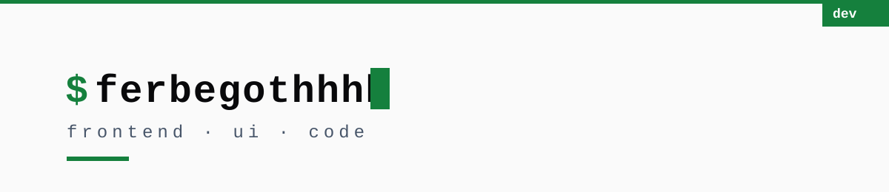
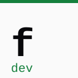

<!--
  Design read: developer profile page for technical peers.
  Style: brutalism (sharp corners, high contrast, mono identity).
  Dials: ENERGY 3 / RHYTHM 2 / MOTION 1.
  Accent: green run #22c55e as dark-only identity motif; contrast-safe
  green #15803d on light variants. All badge text >= 4.5:1.

  TODO:
  1. Upload assets/profile.jpeg as your GitHub profile picture.
  2. Put your real portfolio link in the Connect section once it is live.
-->

  <picture>
    <source media="(prefers-color-scheme: dark)" srcset="assets/banner-dark.svg">
    
  </picture>

<h3 align="center">
  <picture>
    <source media="(prefers-color-scheme: dark)" srcset="assets/logo-dark.svg">
    
  </picture>
  &nbsp;Hi, I'm @ferbegothhhh
</h3>

  Frontend developer. I build interfaces and care how they behave, not just how they look.

---

### STACK

---

### METRICS

  

---

### PROJECTS

| Project | Stack |
|---|---|
| [Galery](https://github.com/ferbegothhhh/Galery) | CSS |
| [mhyow](https://github.com/ferbegothhhh/mhyow) | TypeScript |
| more on the way | |

---

### CONNECT

[]

I will link my portfolio here once it is live.